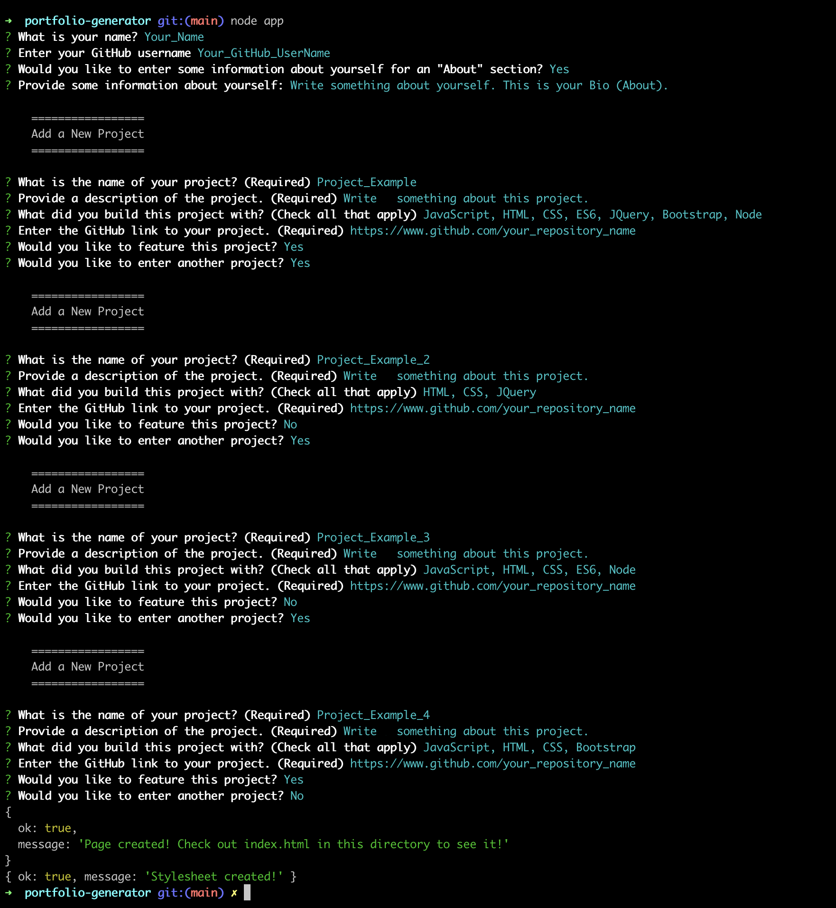
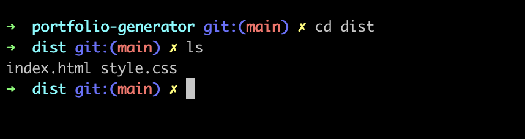
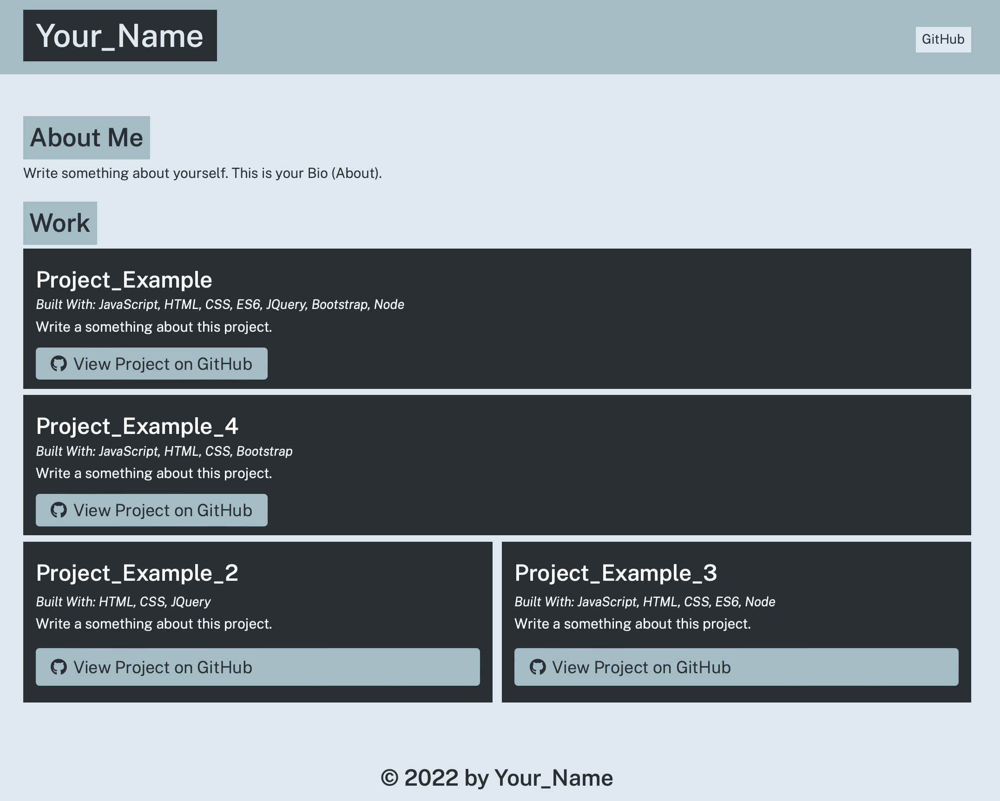

# portfolio-generator

`portfolio-generator` is a tool built with `Node.js` that assists users in creating an online professional portfolio using `HTML` and `CSS`.

Prerequisites:
*   Have `Node.js` installed.
    *   You can certify that `Node.js` is installed by running `node -v`.

## Install
First clone the repository somewhere in your machine.

### Example:
    mkdir github-portfolio
    cd github-portfolio
    git clone git@github.com:rfabreu/portfolio-generator.git

Next, `cd` into the `portfolio-generator` folder and run `npm install` or `npm i`.

## Usage
From the command line certify that you are in the `portfolio-generator` folder:
-   Next, run `node app` or `node app.js` to initialize the application.
-   Fill all the required prompts in your `terminal`.
-   If the execution is successful, you should see two **success** messages when the application finishes running:
    -   Then you should find the `HTML` and `CSS` files in the `dist` folder.

 

## Screenshots
### Example of a successful run:
 

#### Application running:

   

#### Output files generated by the application:

   

#### Final result running on the browser:
